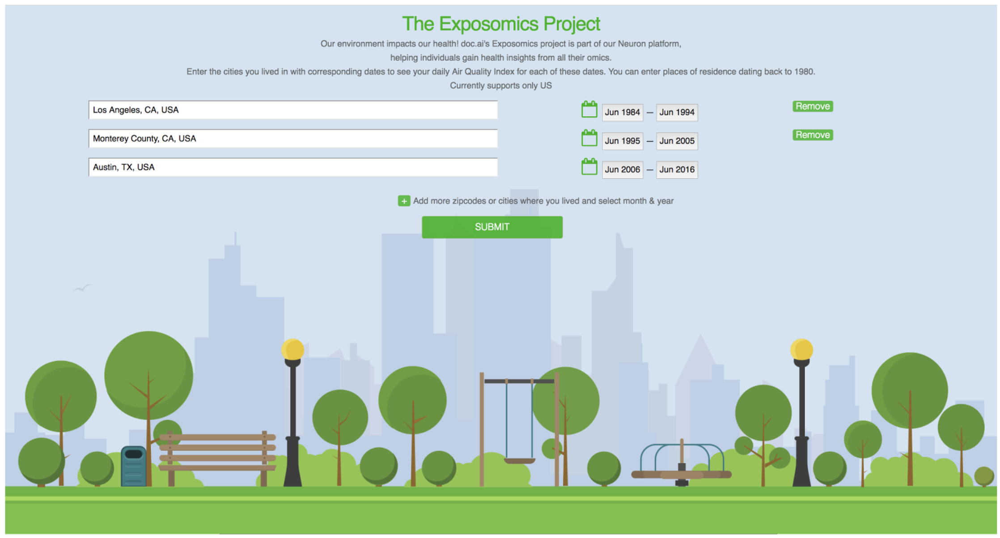
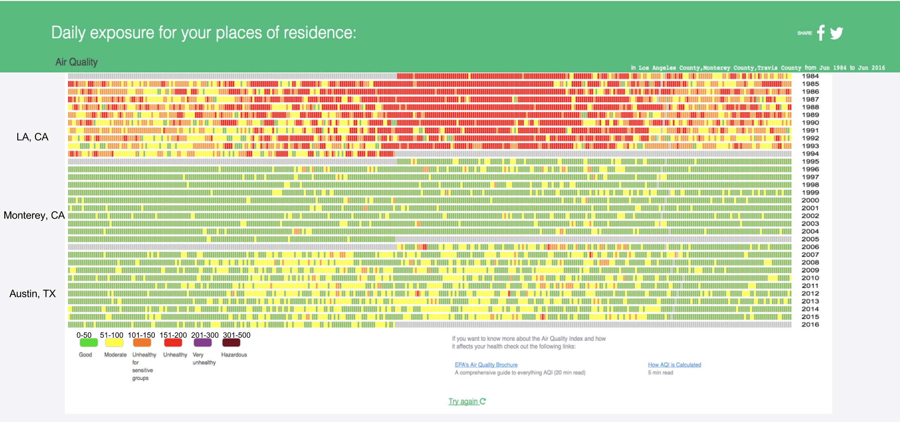

# Example: Air Quality

## THE EXPOSOMIC CHALLENGE
Our environment impacts our health

The Exposomics challenge is part of doc.ai’s solution, helping individuals
collect and gain health insights from all of their omics-quantified biology.

Enter the cities/date you have lived
** Currently supports US locations only

Here are what you have been exposed to at the areas of your residence.

