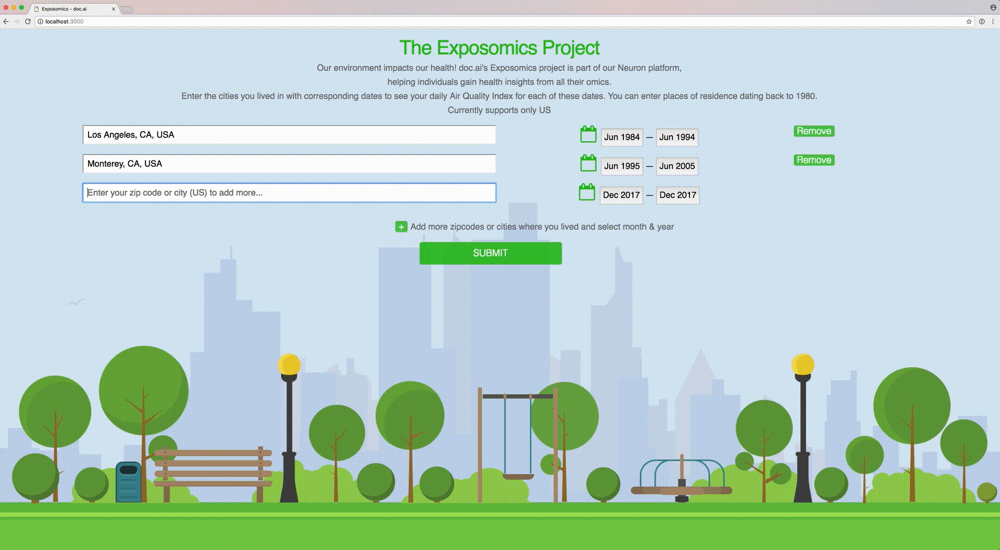

# Home

### “CAN YOU PREDICT HEALTH FROM WHAT YOU HAVE BEEN EXPOSED TO?”

Before birth, our exposures to various environmental stressors begins. Expos-omic measures all the exposures of an individual in a  lifetime and how those exposures relate to health. Using “omic” techniques the collected exposure data can be linked to biochemical and molecular changes in our body. By understanding the impact of these exposomes, for the first time we are able to create a holistic profile of each individual’s health and risk for diseases.

How do people connect to and describe quantitatively what we have been exposed to? Unfortunately, exposomics data, like other sources of data, have never been aggregated or studied in conjunction with other health data points. That’s why doc.ai, an AI-powered healthcare startup based in Silicon Valley , has created this open-source Exposomics challenge. We believe a collaboration between data scientists and developer communities is the best way to extract health insights from the richest exposomic datasets around us!

### THE EXPOSOMIC CHALLENGE
([…for more info](manual/details.html))

The challenge is hosted on doc.ai Exposomic repository. The goal of this challenge is to design a microapp and write extensions to the doc.ai exposomic module. The best extensions will be integrated into doc ai solution that performs DL computations on all other quantified biology to improve health and accelerate scientific research.

## PRIZES (sponsored by doc.ai)

*  ### 1st  Prize – 20,000$NRN ($2,000 market value, 2017 Oct)
*  ### 2nd Prize – 10,000$NRN ($1,000 market value, 2017 Oct)
*  ### 3rd Prize – 5,000$NRN ($500 market value, 2017 Oct)

*  ### Best Visualization Prize – 10,000$NRN ($1,000 market value, 2017 Oct)
*  ### Best Dataset Prize – 10,000$NRN ($1,000 market value, 2017 Oct)
*  ### Best International Prize – 10,000$NRN ($1,000 market value, 2017 Oct)

*  ### **Invite your friends to the challenge for extra 200 $NRN referral bonus!
 ** referral bonus, up to 20,000$NRN, applies upon a valid submission
 
 ## [Join the challenge!](https://github.com/doc-ai/exposomics/tree/develop)

***
